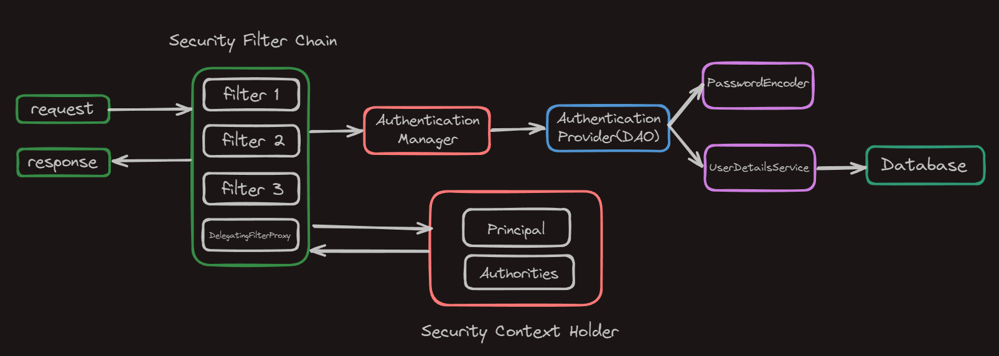

# Ejercicio de Autenticación y Permisos
Ejercicio que implementa autenticación en Spring Security mediante DAO Provider en Spring Boot, utilizando la base de datos para la gestión de usuarios y roles, con un sistema de login personalizado. Además, emplea Thymeleaf para las vistas y la interfaz del usuario.

## Modelo ER

  

## Infraestructura Spring Security

  

### Componentes de la Arquitectura de Autenticación en Spring Security

1. **Security Filter Chain:**  
   La **security filter chain** es una secuencia de filtros que interceptan las solicitudes HTTP antes de que lleguen a los controladores de la aplicación. Cada filtro en esta cadena puede realizar varias funciones, como autenticar al usuario, verificar permisos o gestionar sesiones. Su objetivo es garantizar que solo los usuarios autenticados y autorizados puedan acceder a ciertos recursos de la aplicación.

2. **AuthenticationManager:**  
   El **AuthenticationManager** es un componente central en Spring Security encargado de manejar el proceso de autenticación. Cuando una solicitud de autenticación llega, este gestor delega el proceso a uno o más proveedores de autenticación, como el **DAO Authentication Provider**. Si la autenticación es exitosa, el `AuthenticationManager` devuelve un objeto `Authentication`, que contiene información sobre el usuario autenticado, incluidos sus roles y permisos.

3. **DAO Authentication Provider:**  
   El **DAO Authentication Provider** es un proveedor de autenticación que utiliza una base de datos para validar las credenciales del usuario. Se basa en un `UserDetailsService` para cargar los detalles del usuario desde la base de datos. Este enfoque permite que las credenciales del usuario se almacenen de forma segura y se verifiquen eficientemente.

4. **UserDetailsService:**  
   El **UserDetailsService** es una interfaz que define cómo recuperar los detalles del usuario. Debe implementar el método `loadUserByUsername`, que busca y devuelve un objeto `UserDetails` basado en el nombre de usuario proporcionado. Este objeto incluye información esencial, como el nombre, la contraseña y los roles del usuario, que son necesarios para la autenticación y autorización.

5. **PasswordEncoder:**  
   El **PasswordEncoder** es un componente utilizado para codificar y comparar contraseñas. Cuando un usuario intenta iniciar sesión, la contraseña que proporciona se codifica utilizando el mismo algoritmo que se utilizó para almacenar la contraseña en la base de datos. Este proceso asegura que las contraseñas nunca se almacenen en texto plano, mejorando la seguridad de la aplicación. Spring Security ofrece varias implementaciones de `PasswordEncoder`, como `BCryptPasswordEncoder`, que utiliza el algoritmo BCrypt para mayor seguridad (implementado en el proyecto).
