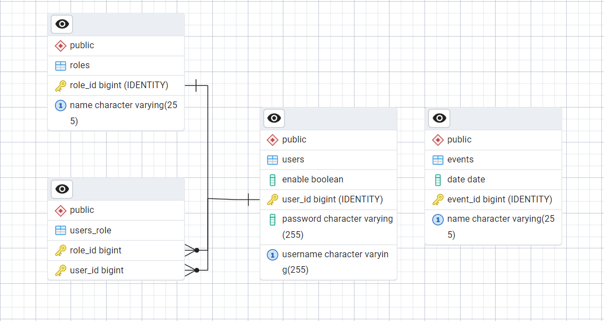

# Ejercicio de Autenticación y Permisos
Ejercicio que implementa Spring Security en Spring Boot para proteger endpoints según roles de usuario.

## Modelo ER

  

## Infraestructura Spring Security
